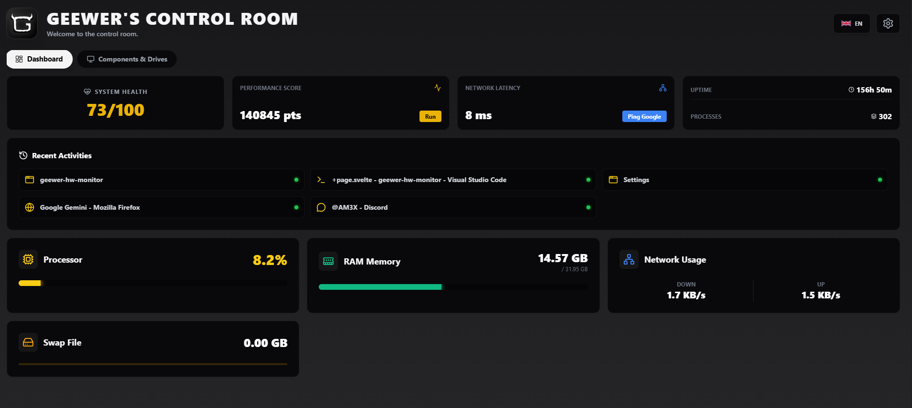

<div align="center">
  
  <h1>Geewer's Control Room</h1>
  <p>
    <strong>Ta station de contrôle ultime pour PC. / Your ultimate PC control station.</strong>
  </p>
  
  
</div>

<br />

---

## 🇫🇷 Français

Salut ! Bienvenue sur le repo de **Geewer's Control Room**.

C'est un petit outil puissant (mais léger !) que j'ai développé pour garder un œil sur mon PC sans me prendre la tête. Fini les gestionnaires de tâches moches, place à une interface Cyberpunk/Gamer fluide et réactive.

### 🚀 Ce que ça fait
* **Tableau de bord en temps réel :** Surveille ton CPU, ta RAM, ton Swap et ton débit Réseau (Upload/Download) à la seconde près.
* **Santé du PC :** Une note globale sur 100 pour savoir si ton PC souffre.
* **Outils intégrés :**
    * 🧪 **Benchmark CPU :** Teste la puissance brute de ton processeur.
    * 🌐 **Test Latence :** Un ping rapide vers Google pour vérifier ta connexion.
    * 🔄 **Activités Récentes :** Liste les dernières applications que tu as ouvertes.
* **Infos Détaillées :** Tout sur tes disques, ta carte graphique (détection intelligente), tes écrans et tes périphériques USB.
* **Customisation :** Change les couleurs, le thème, tout est sauvegardé !

### 🛠️ Comment l'installer (Dev)
Si tu veux bidouiller le code, c'est du **Tauri (Rust)** avec **Svelte** :

1.  Clone le projet.
2.  Installe les dépendances :
    ```bash
    npm install
    ```
3.  Lance le mode dév :
    ```bash
    npm run tauri dev
    ```

---

## 🇬🇧 English

Hi there! Welcome to the **Geewer's Control Room** repo.

This is a powerful (yet lightweight!) tool I built to keep an eye on my PC stats without the headache. No more ugly task managers, say hello to a smooth, Cyberpunk/Gamer interface.

### 🚀 Features
* **Real-time Dashboard:** Monitor CPU, RAM, Swap, and Network speed (Up/Down) live.
* **System Health:** A global score out of 100 to know if your PC is struggling.
* **Built-in Tools:**
    * 🧪 **CPU Benchmark:** Test your processor's raw power.
    * 🌐 **Latency Test:** Quick ping test to check your connection.
    * 🔄 **Recent Activities:** See which apps you launched recently.
* **Detailed Specs:** Everything about your drives, GPU (smart detection), monitors, and USB peripherals.
* **Customization:** Change colors, themes, everything is saved!

### 🛠️ How to run it (Dev)
If you want to tinker with the code, it's built with **Tauri (Rust)** and **Svelte**:

1.  Clone the project.
2.  Install dependencies:
    ```bash
    npm install
    ```
3.  Run dev mode:
    ```bash
    npm run tauri dev
    ```

---

<div align="center">
  Made with ❤️ by <strong>Geewer</strong>
</div>